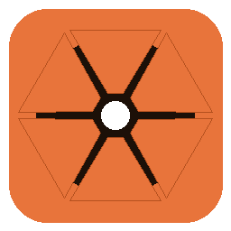

# MCRAW Studio

*by **KIRA***

A bulk transcoder for [MotionCam Pro](https://www.motioncamapp.com/) `.mcraw`
files, with an ACES-aware color pipeline. Drag clips in, pick a delivery
format, hit render — get clean MP4s, ProRes/DNxHR/CineForm intermediates,
or EXR sequences out.



## Download

Single-file Windows executable: **`MCRAWStudio.exe`** (~60 MB).

Get it from the
[**Releases**](https://github.com/) page (TBD). No installer — just download
and run. Windows SmartScreen will warn the first time because the binary
isn't code-signed yet; click *More info* → *Run anyway*.

## Features at a glance

- **Drag-and-drop bulk transcode** of `.mcraw` files, with per-clip in/out
  scrubbing and a frame preview
- **Outputs**:
  - **MP4** (H.264 / H.265 / AV1) — for delivery and "normal video" playback
  - **MOV** (ProRes 422 / 422 HQ / 4444 / 4444 XQ, DNxHR HQX / 444, CineForm)
    — for grading and NLE work
  - **EXR sequences** with selectable compression (PIZ / ZIP / DWAB / etc.)
    — for VFX and compositing
  - **MCRAW (trimmed)** — bit-perfect cut of a section, keeps the source RAW
    for later re-processing
- **GPU acceleration via NVENC** for H.264 / H.265 / AV1 (auto-detected;
  falls back to CPU encoders on machines without an NVIDIA GPU)
- **Concurrent renders** (1–4 clips in parallel) for big batch jobs —
  ~2.7× speedup on ProRes 4444 with 3 workers on a 16-core machine
- **Color-managed pipeline** built on
  [OpenColorIO](https://opencolorio.org/) studio-config-v4.0
  - ACEScg internal working space; lens shading, white balance and color
    matrix from per-frame metadata
  - Output color space + transfer curve picked separately, mobile-app style:
    BT.709 / sRGB / Rec.2020 / DaVinci Wide Gamut / ACEScg / ACES AP0,
    paired with Linear / sRGB / BT.709 / ST2084 PQ / HLG / Cineon / DaVinci
    Intermediate / ACES CCT
  - HDR transfers (PQ / HLG) auto-gate the codec list to 10-bit-capable
    encoders
- **Vignette correction** automatically applied from the per-frame
  lens-shading map
- **Two-axis denoise** for MP4 deliverables (chroma + luma sliders, like
  Camera Raw's color/luminance pair)
- **Parallel EXR sequence rendering** — 8 worker threads, ~10 fps at 4K

## How to use

1. Run `MCRAWStudio.exe`.
2. Drop one or more `.mcraw` files into the file list (or *Add Files…*).
3. Click a file to see a preview. Use the slider to scrub. *Mark In* /
   *Mark Out* to set a per-clip render range.
4. Pick a **Format** — MP4, MOV, EXR, or MCRAW (trim).
5. Pick **Codec**, **Color Space**, **Transfer Function** as needed. The
   irrelevant controls grey out automatically per format.
6. Click **Render All**. Outputs are written next to the source file with
   names that include the codec and color space, e.g.
   `clip_h265_nvenc_rec709-display.mp4`.

## CLI

The same engine is also available as `mcraw_render.exe` for scripting:

```
mcraw_render input.mcraw -o out.mp4 --codec h265_nvenc -c rec709-display
mcraw_render input.mcraw -o trimmed.mcraw --format mcraw --start 100 --end 200
mcraw_render input.mcraw -o frames/ --exr-compression piz
```

Run `mcraw_render --help` for the full option list.

## Python module

A `mcraw` Python module (built as part of the project) gives library-level
access to the decoder + pipeline:

```python
import mcraw
d = mcraw.Decoder("clip.mcraw")
print(d.frame_count, d.audio_sample_rate)
mcraw.render(input="clip.mcraw", output="out.mp4",
             codec="h265_nvenc", colorspace="rec709-display",
             ten_bit=True, denoise_chroma=30)
mcraw.trim_mcraw("clip.mcraw", "trim.mcraw", start=50, end=150)
```

## System requirements

- **OS**: Windows 10 64-bit or Windows 11
- **GPU** (optional): any NVIDIA GPU enables NVENC H.264/H.265, RTX 40+
  enables AV1 NVENC. Without an NVIDIA GPU the CPU codecs (libx264 /
  libx265) are used automatically.
- **Disk**: roughly the size of your inputs again, plus working space for
  whatever you're rendering. EXR sequences can be 5–30× larger than the
  source MCRAW.

## Building from source

For developers who want to build the project themselves.

### Dependencies

- A C++17 compiler (Visual Studio 2022 or 18 Insiders on Windows)
- [vcpkg](https://vcpkg.io) with the following ports installed for
  `x64-windows`:
  ```
  vcpkg install ffmpeg[avcodec,avdevice,avfilter,avformat,gpl,nvcodec,swresample,swscale,x264,x265]
  vcpkg install openexr opencolorio pybind11 nlohmann-json
  ```
- [CMake](https://cmake.org/) 3.15+
- [Python 3.12](https://www.python.org/) with PySide6 + Pillow + PyInstaller:
  ```
  python -m pip install PySide6 Pillow pyinstaller
  ```

### Build

```bat
configure.bat        :: invokes CMake with the right vcpkg toolchain
cmake --build build
```

This produces:
- `build/mcraw_render.exe` — CLI transcoder
- `build/mcraw.cp312-win_amd64.pyd` — Python module
- `build/example.exe` — the original library demo

### Bundle the GUI .exe

```bat
:: Optional env vars if your toolchain isn't in the default locations:
set VCPKG_INSTALL_DIR=C:\dev\vcpkg\installed\x64-windows
set MSVC_REDIST_BIN_DIR=C:\Program Files\...\VC\Tools\MSVC\14.50.35717\bin\Hostx64\x64

python -m PyInstaller motioncam_tools.spec --noconfirm
```

Result: `dist\MCRAWStudio.exe` (single self-contained 60 MB binary).

### Generate the icon (one-time)

```bat
python tools\gen_icon.py
```

Produces `gui/icon.ico` and `gui/icon.png`.

## Project layout

- `lib/` — core C++ library
  - `Decoder.cpp` — MCRAW reader (originally MotionCam's library code)
  - `Trimmer.cpp` — MCRAW writer for the trim feature
  - `RawData*.cpp` — bayer compression codecs
  - `ColorPipeline.cpp` — black/white normalize, debayer, color matrix
  - `Debayer.cpp` — bilinear demosaic + lens shading correction
  - `OcioTransform.cpp` — OpenColorIO bridge
  - `BakedTransform.cpp` — fast-path transforms for common output spaces
  - `Denoise.cpp` — chroma + luma noise reduction
  - `MovEncoder.cpp` — ProRes / DNxHR / CineForm / H.26x / AV1 encoder via
    FFmpeg
  - `ExrWriter.cpp` — OpenEXR sequence writer
- `mcraw_render.cpp` — CLI transcoder
- `python/mcraw_py.cpp` — pybind11 bindings for the `mcraw` Python module
- `gui/motioncam_tools.py` — Qt6 GUI app (PySide6)
- `gui/style.qss` — Qt stylesheet (dark theme)
- `tools/gen_icon.py` — one-shot icon generator (Pillow)

## License

Apache License 2.0 — see [LICENSE](LICENSE). Underlying decoder library is
also Apache 2.0 from the original [MotionCam decoder](
https://github.com/mirsadm/motioncam-decoder) project.

## Sample MCRAW

You can grab a sample file to test with from
[here](https://storage.googleapis.com/motioncamapp.com/samples/007-VIDEO_24mm-240328_141729.0.mcraw).
